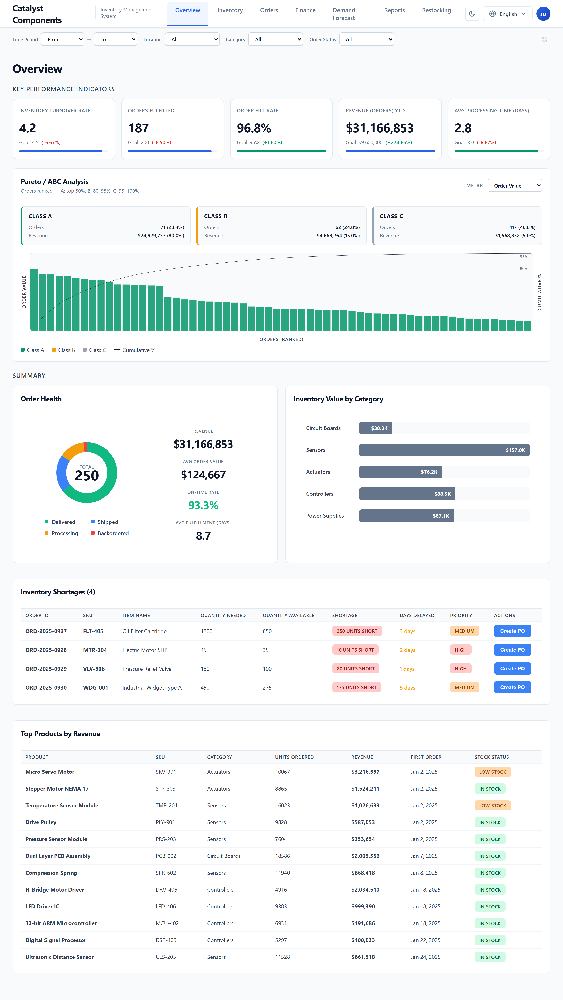
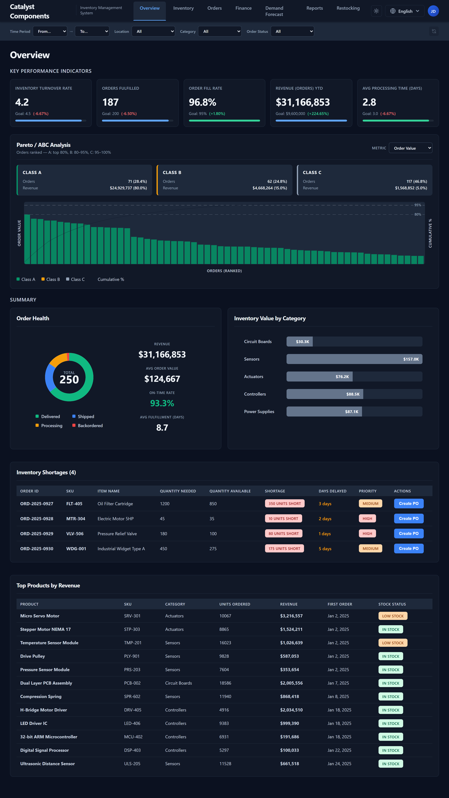
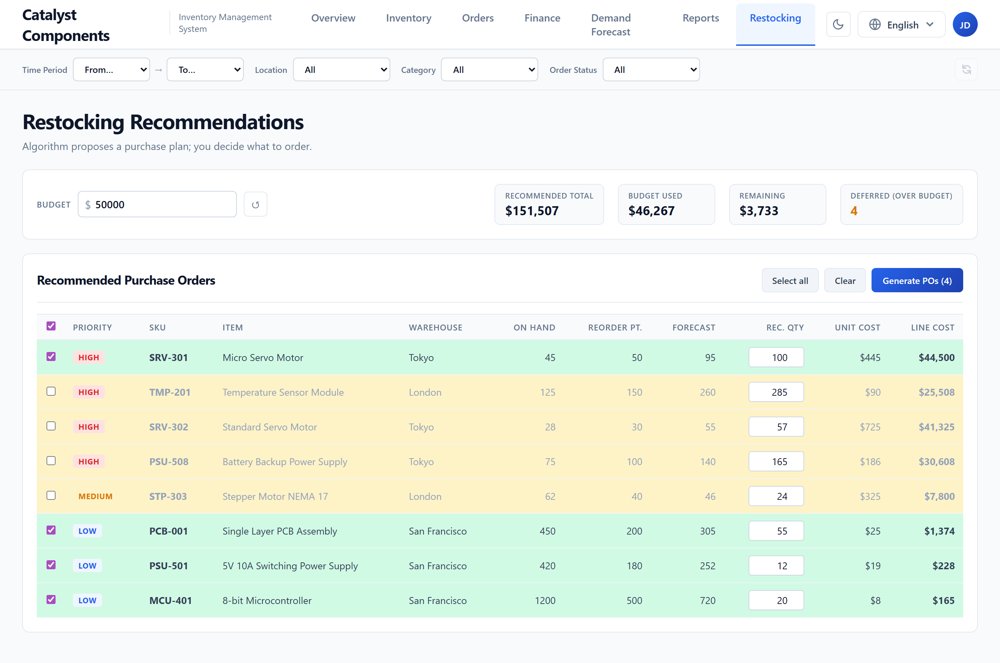
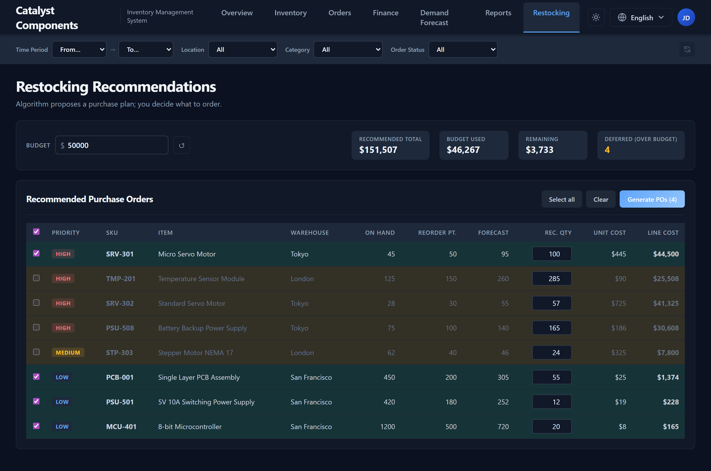
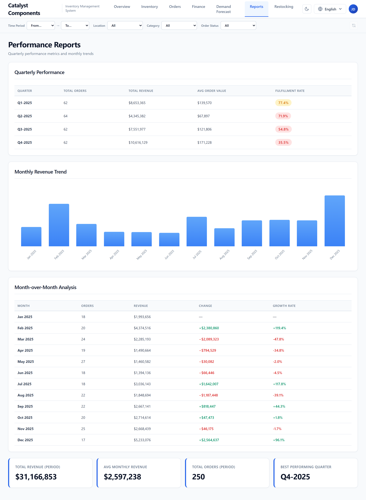
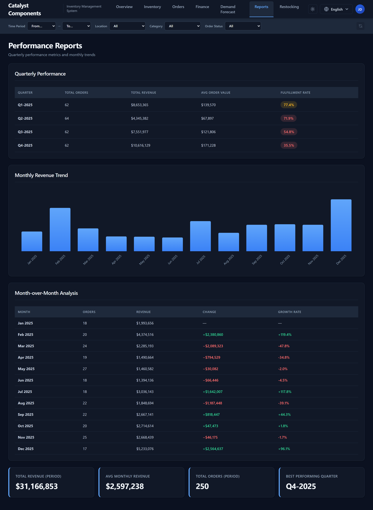
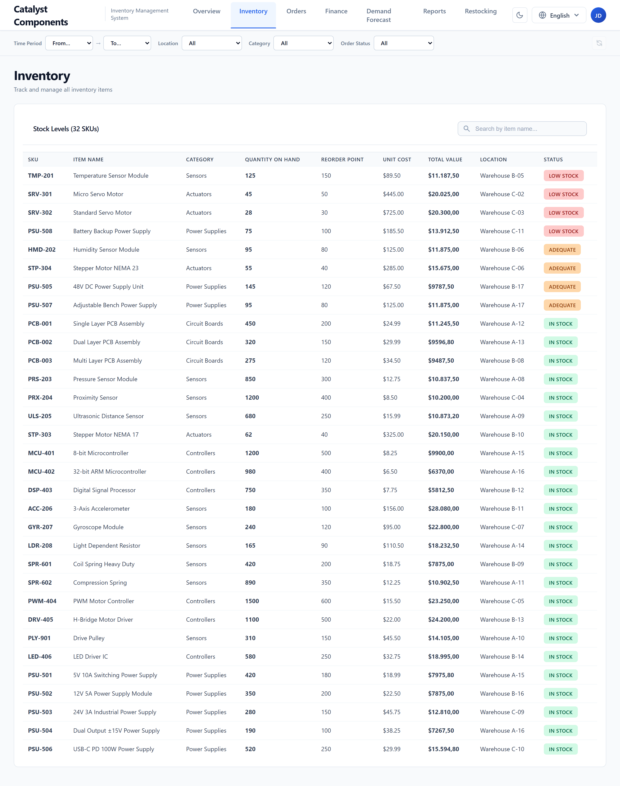
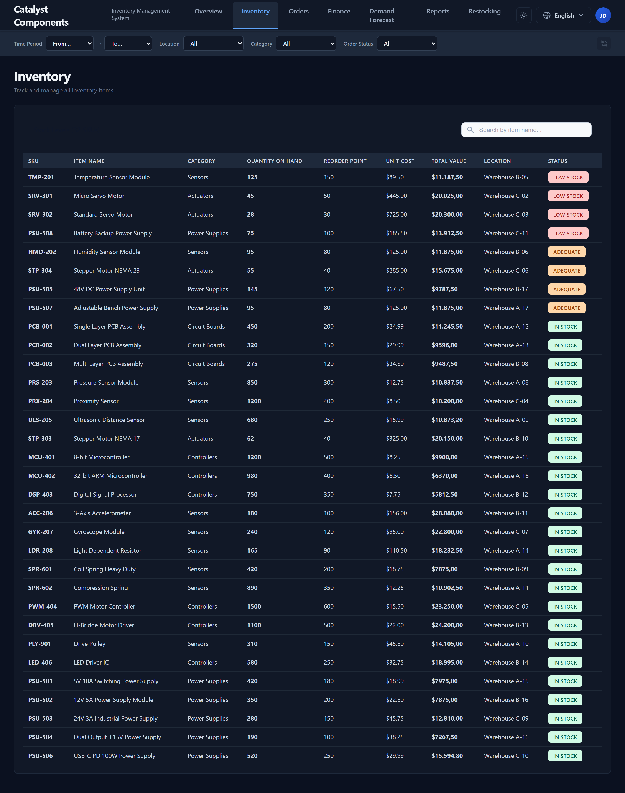

# Meridian Inventory Dashboard — Engagement Delivery

Modernization of Meridian Components' inventory dashboard, delivered against
**RFP MC-2026-0417**.

Vue 3 + FastAPI, three locales (English / Italian / Japanese), light & dark
themes, Pareto/ABC analysis, budget-aware restocking with real purchase-order
creation, and a Playwright suite covering the critical flows.

### 🔗 Live demo

**[https://defe8.github.io/meridian-workshop-delivery/](https://defe8.github.io/meridian-workshop-delivery/)**

The live site runs in *demo mode*: the SPA is served from GitHub Pages and the
seed JSON ships with the bundle, so reads (KPIs, Pareto, Reports, Restocking
recommendations, filters, language switch, dark mode) all work as in the
real app. Writes (creating tasks, generating POs) are simulated in memory and
reset on reload — there's no live FastAPI backend behind the page.

---

## Preview

### Overview

Five KPI cards with positive/negative delta colour coding, a Pareto/ABC
analysis card with a clickable class filter and a switchable Y-axis metric,
order-health donut, inventory-by-category bars, shortages table, and the
top-products table — all responsive to the global filter bar at the top.

| Light | Dark |
| --- | --- |
|  |  |

### Restocking (R2)

Algorithm proposes a ranked purchase plan using each SKU's reorder point and
forecast demand; greedy fill against an operator-supplied budget ceiling marks
overflow rows as "deferred". Editable per-row quantity, live KPIs, and a
confirm modal that creates real `Draft` POs on the backend (persisted to
`server/data/purchase_orders.json`).

| Light | Dark |
| --- | --- |
|  |  |

### Reports (R1)

Quarterly performance, monthly revenue trend, month-over-month comparison, and
summary stats — all filter-aware (period range, warehouse, category, status)
and currency-aware.

| Light | Dark |
| --- | --- |
|  |  |

### Inventory & Orders

| | Light | Dark |
| --- | --- | --- |
| Inventory |  |  |
| Orders |  |  |

---

## What was delivered

| Item | Status | Notes |
| --- | --- | --- |
| **R1** Reports remediation | ✅ | 13 defects fixed (i18n, console noise, central API client, currency, filter respect, Composition API rewrite) |
| **R2** Restocking recommendations | ✅ | New view, operator-in-control flow, real `POST /api/purchase-orders` (didn't exist before) |
| **R3** Automated browser tests | ✅ | 11 Playwright specs covering critical flows, all green |
| **R4** Architecture documentation | ✅ | [`proposal/architecture.html`](proposal/architecture.html) |
| **D1** UI modernization | ✅ | Design tokens via CSS variables across the entire app |
| **D2** Internationalization | ✅ | EN / IT / JA + USD / EUR / JPY |
| **D3** Dark mode | ✅ | OS preference detection + manual toggle, full coverage |
| Bonus | ✅ | Pareto / ABC analysis, period range filter, JSON-file persistence for tasks & POs |

Detailed architecture and engagement narrative:
[proposal/architecture.html](proposal/architecture.html) · the original
proposal package lives under [proposal/](proposal/).

---

## Run it locally

Prerequisites:

- Node.js 18+
- Python 3.11+ and [`uv`](https://docs.astral.sh/uv/)

```bash
# Backend (port 8001)
cd server && uv sync && uv run python main.py

# Frontend (port 3000)
cd client && npm install && npm run dev
```

Or use the bundled helper: `./scripts/start.sh`.

---

## Test it

```bash
# Backend pytest (51 unit tests covering every endpoint)
cd tests && uv run pytest -v

# Frontend Playwright suite (11 e2e tests)
cd tests/e2e && npm install && npx playwright install chromium && npm test
```

Re-capture the screenshots in this README:

```bash
cd tests/e2e && node scripts/capture-screenshots.js
```

---

## Repository layout

```
.
├── client/                Vue 3 + Vite frontend
│   └── src/
│       ├── views/         one .vue per route
│       ├── components/    modals, FilterBar, ProfileMenu, ThemeToggle, …
│       ├── composables/   useFilters, useI18n, useAuth, useTheme
│       ├── locales/       en.js / it.js / ja.js
│       └── utils/         currency formatting
├── server/                FastAPI backend
│   ├── main.py            routes + filter helpers
│   ├── mock_data.py       loads JSON, atomic write-back for mutables
│   └── data/*.json        seed + persisted state
├── tests/
│   ├── backend/           pytest (51 unit tests)
│   └── e2e/               Playwright (11 e2e tests + screenshot script)
├── proposal/              RFP response artefacts (exec summary, deck, architecture)
└── docs/screenshots/      images embedded above
```
